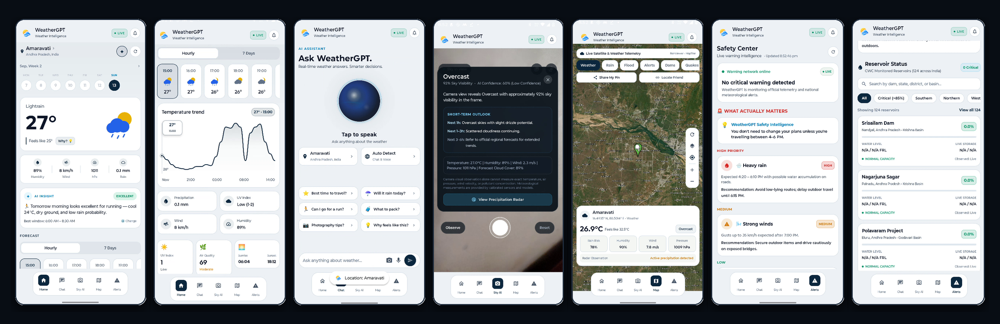
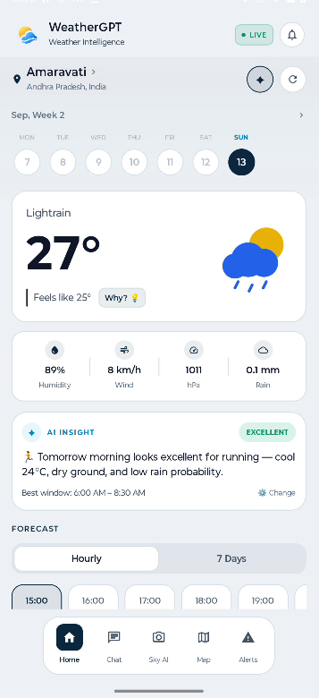
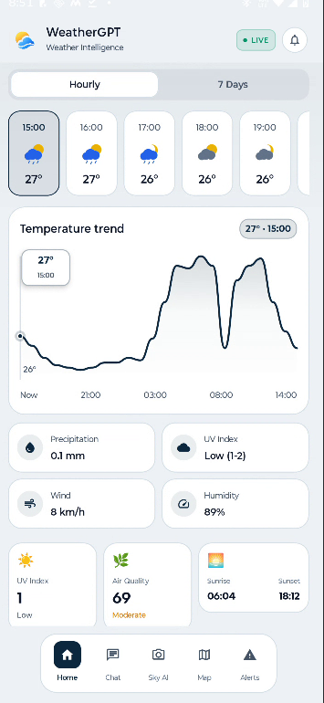
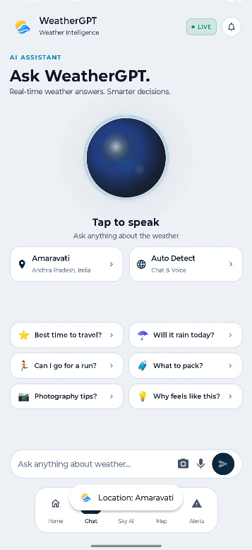
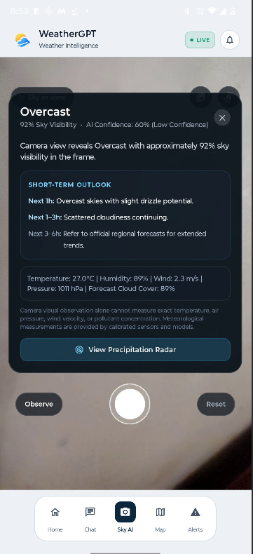
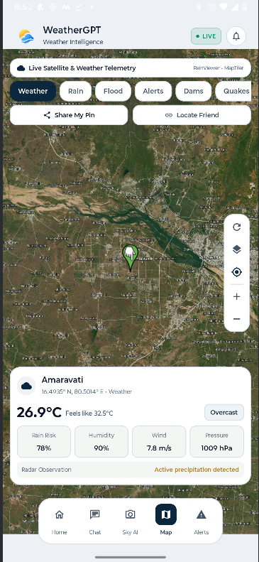
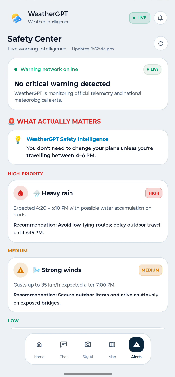
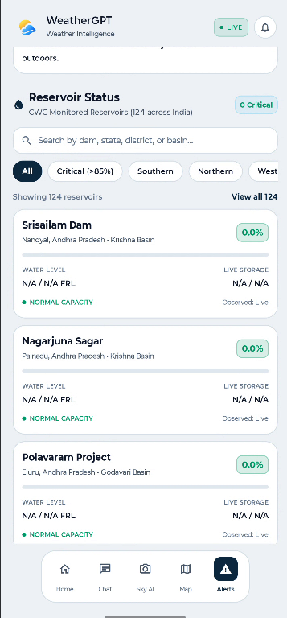
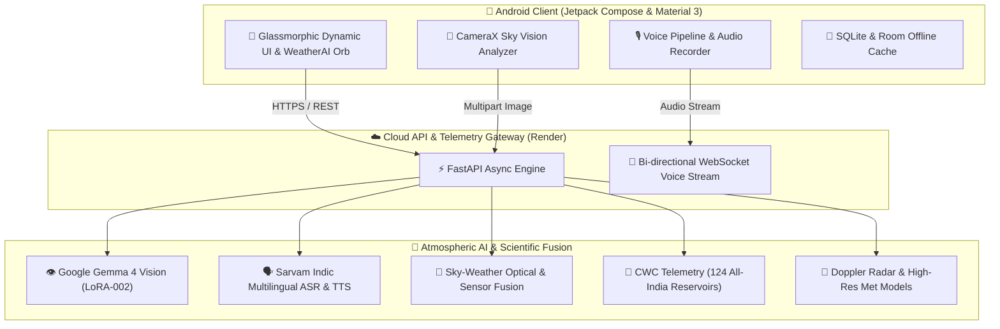

# <p align="center"><br/><br/><strong>WeatherGPT</strong></p>

<p align="center">
  <em>Next-Generation Autonomous Atmospheric Intelligence • Multimodal Sky Vision • National Flood Defense • Indic Multilingual Voice AI</em>
</p>

<p align="center">
  <a href="https://github.com/Ismit-06/Weather_GPT/releases"></a>
  <a href="https://weather-gpt-ymze.onrender.com"></a>
  <a href="#-instant-download--quick-installation"></a>
  <a href="#-license"></a>
  <a href="https://github.com/Ismit-06/Weather_GPT/stargazers"></a>
</p>

<p align="center">
  
</p>

---

## 📱 Live App Experience Showcase

<p align="center">
  <a href="assets/app_mockup_showcase.png">
    
  </a>
</p>

<p align="center">
  <sub><strong>From Left to Right:</strong> 1. Home Dashboard • 2. Temperature Curves &amp; Forecast • 3. Multilingual Voice AI • 4. Sky Vision Camera AI • 5. Turbo Doppler Radar Map • 6. Weather Safety Center • 7. CWC Dam Intelligence (124 Reservoirs)</sub>
</p>

<br/>

<details open>
<summary><strong>🔍 Interactive Screen-by-Screen Tour</strong></summary>

<br/>

| **1. Home Dashboard** | **2. 24h &amp; 7-Day Forecast** | **3. Ask WeatherGPT Voice AI** | **4. Sky-AI Camera Vision** |
| :---: | :---: | :---: | :---: |
| <a href="assets/screenshots/01_home.png"></a> | <a href="assets/screenshots/02_forecast.png"></a> | <a href="assets/screenshots/03_chat.png"></a> | <a href="assets/screenshots/04_sky_ai.png"></a> |
| Real-time conditions, animated weather art, AI Activity Recommendations &amp; Hourly cards | Spline temperature curve, Air Quality (AQI), UV index, Sunrise/Sunset &amp; Barometric metrics | Pulsing WeatherAI Orb, 12 Indic languages, one-tap advice chips &amp; voice input | Point-to-sky CameraX vision, Gemma 4 cloud classification &amp; 1h/3h/6h rain outlook |

<br/>

| **5. Turbo Doppler Map** | **6. Safety Center Alerts** | **7. CWC Dam Flood Intelligence** |
| :---: | :---: | :---: |
| <a href="assets/screenshots/05_map.png"></a> | <a href="assets/screenshots/06_alerts.png"></a> | <a href="assets/screenshots/07_dams.png"></a> |
| 12-thread parallel raster engine, precipitation radar, satellite terrain &amp; friend pin locator | Contextual AI advisory ("What Actually Matters"), High/Medium/Low priority alerts | 124 monitored reservoirs across 31 Indian states/UTs, live FRL, storage % &amp; flood risk |

</details>

---

## 🚀 Instant Download & Quick Installation

Anyone can directly download and install WeatherGPT on their Android device:

<p align="center">
  <a href="https://github.com/Ismit-06/Weather_GPT/releases/latest/download/app-release.apk">
    
  </a>
  &nbsp;&nbsp;
  <a href="https://github.com/Ismit-06/Weather_GPT/releases">
    
  </a>
</p>

<details open>
<summary><strong>📦 Package Variants & Architecture Matrix</strong></summary>

<br/>

| Package Variant | Architecture / Platform | Direct Download Link | Integrity & Details |
| :--- | :--- | :--- | :--- |
| **Production Release APK** | Universal (`arm64-v8a`, `armeabi-v7a`, `x86_64`) | [**📥 Download `app-release.apk`**](https://github.com/Ismit-06/Weather_GPT/releases/latest/download/app-release.apk) | Optimized, ZipAligned, V2/V3 Signed, Pixel-compatible |
| **Developer Debug APK** | Universal with developer logcat diagnostics | [**🛠️ Download `app-debug.apk`**](https://github.com/Ismit-06/Weather_GPT/releases/latest/download/app-debug.apk) | Debug signature enabled |
| **Cloud Microservice** | REST API & Bi-directional WebSockets | [**🌐 Open Live Render Backend**](https://weather-gpt-ymze.onrender.com) | FastAPI + Uvicorn Production Gateway |

> [!TIP]
> **Android Quick Install Instructions:**
> 1. Tap **`Download Latest Release APK`** directly on your phone.
> 2. Open the downloaded `.apk` file from your browser downloads or file manager.
> 3. If prompted with *"Install unknown apps"*, toggle **Allow from this source**.
> 4. Tap **Install** and experience WeatherGPT!

</details>

---

## ⚡ Architectural Blueprint

WeatherGPT combines client-side edge computing, computer vision, and national water telemetry with high-performance LLM orchestration:



---

## ✨ Cutting-Edge Technical Capabilities

### 👁️ 1. Sky-AI: Visual Cloud Perception & Confounder Rejection
- **Gemma 4 Fine-Tuned Model**: Utilizes **Google Gemma 4 26B A4B Instruct** specialized via LoRA (**`SKY-LORA-002`**) for atmospheric cloud dynamics.
- **Confounder Rejection Engine**: Actively eliminates non-sky indoor false positives (e.g. blue bedsheets, curtains, tinted glass, ceiling textures, computer displays) via spectral frequency analysis and edge-density heuristics.
- **Multimodal Atmospheric Fusion**: Fuses live CameraX RGB telemetry, ambient brightness, and orientation metadata with meteorological radar models to classify cloud altitude, density, and immediate rain risk.

### 🌊 2. All-India Dam Intelligence & Flood Early Warning (CWC)
- **124 Monitored Dams Across 31 States & UTs**: Full telemetry synchronization from the Central Water Commission (CWC).
- **Comprehensive River Basins**: Krishna, Godavari, Ganga, Indus, Narmada, Cauvery, Mahanadi, Brahmaputra, Tapi, Sabarmati, and more.
- **Real-Time Hydrological Metrics**: Full Reservoir Level (FRL in meters), current water level, live storage vs total capacity in BCM (Billion Cubic Meters), and storage percentage.
- **Automated Risk Stratification**:
  - `CRITICAL SPILL RISK` ($\ge 90\%$)
  - `HIGH FLOOD WATCH` ($\ge 85\%$)
  - `MODERATE STORAGE` ($\ge 70\%$)
  - `NORMAL CAPACITY` ($< 70\%$)
- **Interactive Exploration Suite**: Real-time multi-attribute search (dam name, district, river basin, state) with regional filter chips (`Southern`, `Northern`, `Western`, `Eastern`, `Central`).

### 🎙️ 3. Multilingual Indic Voice Assistant (Sarvam AI)
- **12+ Indian Languages Supported**: Native conversational capability in **Hindi, English, Hinglish, Odia, Telugu, Tamil, Kannada, Bengali, Marathi, Gujarati, Malayalam, and Punjabi**.
- **Streaming WebSocket Speech**: Bidirectional voice pipeline for natural audio query transcription and low-latency neural speech synthesis.
- **Sub-50ms FastPath Engine**: Offline-resilient rule-based meteorological engine answering high-frequency weather and outdoor activity queries instantly.

### 🗺️ 4. Turbo Vector Map & Doppler Radar Layers
- **OSMDroid Turbo Engine**: 12 parallel raster rendering threads, 250 in-memory tile cache with 60-day persistent disk cache.
- **Dynamic Layering**: Switch effortlessly between live precipitation radar, thermal contour maps, wind vector particle fields, and satellite imagery.

---

## 🛠️ Technology Stack

| Domain | Frameworks, Tools & Protocols |
| :--- | :--- |
| **Mobile Client** | Kotlin 2.0, Jetpack Compose, Material 3, Coroutines, StateFlow, Navigation Compose, CameraX |
| **Mapping & Radar** | OSMDroid, MapTiler Vector Tiles, OpenWeather Doppler Layers, Leaflet / TileStream |
| **Vision & AI** | Google Gemma 4 (26B A4B LoRA), PyTorch, Hugging Face Transformers, OpenCV, Scikit-Learn |
| **Speech & Multilingual** | Sarvam AI Speech API, Android AudioRecord, Neural TTS, OkHttp WebSocket Streaming |
| **Cloud & Backend** | Python 3.12, FastAPI, Uvicorn, SQLAlchemy, PostgreSQL, Render Cloud Platform |
| **Data & Storage** | Retrofit 2, OkHttp 4, Gson, Room Database, EncryptedSharedPreferences |

---

## 📦 Project Layout

```text
WeatherGPT/
├── Weather_GPT/
│   ├── android/                  # Android Studio project (Kotlin + Jetpack Compose)
│   │   ├── app/src/main/java/    # Screens, ViewModels, AI fusion, Audio engine
│   │   └── app/build.gradle.kts  # Gradle dependencies & signing configuration
│   ├── app/                      # FastAPI cloud service
│   │   ├── routers/              # Dams, Alerts, Visual Cloud, Chat, Hazards, Speech
│   │   ├── services/             # Fusion engines, CWC bulletin parser, Met clients
│   │   └── models/               # SQLAlchemy database schemas
│   ├── sky-ai/                   # LoRA fine-tuning scripts & inference microservice
│   └── requirements.txt          # Python cloud service dependencies
├── assets/                       # Brand assets, animated SVG orb, showcase mockups & audio
│   └── screenshots/              # Real application screenshots (Home, Forecast, Voice, Sky AI, Map, Alerts, Dams)
└── README.md                     # Comprehensive documentation & direct download gateway
```

---

## 💻 Local Development Setup

<details>
<summary><strong>📱 Android Studio Setup</strong></summary>

1. **Clone repository:**
   ```bash
   git clone https://github.com/Ismit-06/Weather_GPT.git
   cd Weather_GPT/Weather_GPT/android
   ```
2. **Setup SDK & MapTiler Key:**
   Create a `local.properties` file in `Weather_GPT/android/`:
   ```properties
   sdk.dir=C:\Users\<USER>\AppData\Local\Android\Sdk
   MAPTILER_API_KEY=your_maptiler_api_key
   ```
3. **Build APKs:**
   ```bash
   # Build Release APK
   ./gradlew assembleRelease

   # Or compile and install directly to connected device
   ./gradlew installDebug
   ```

</details>

<details>
<summary><strong>🐍 Python Backend & Cloud Service</strong></summary>

1. **Navigate to the backend directory and configure venv:**
   ```bash
   cd Weather_GPT
   python -m venv venv
   source venv/bin/activate  # On Windows: .\venv\Scripts\activate
   pip install -r requirements.txt
   ```
2. **Run the development server:**
   ```bash
   uvicorn app.main:app --host 0.0.0.0 --port 8000 --reload
   ```
3. **Interactive Documentation:**
   Navigate to `http://localhost:8000/docs` to test all OpenAPI endpoints.

</details>

---

## 🤝 Contributing

Contributions, feedback, and pull requests are welcomed!
1. Fork the Project
2. Create your Feature Branch (`git checkout -b feature/AtmosphericFeature`)
3. Commit your Changes (`git commit -m 'Add AtmosphericFeature'`)
4. Push to the Branch (`git push origin feature/AtmosphericFeature`)
5. Open a Pull Request

---

## 📄 License

Distributed under the **MIT License**. See `LICENSE` for more information.

<p align="center">
  <sub>Built with ❤️ by the WeatherGPT Team • Advancing Autonomous Atmospheric Science</sub>
</p>
